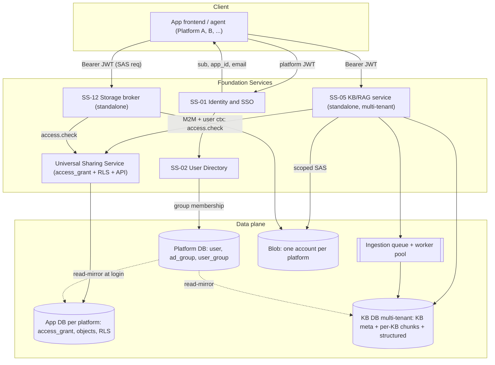
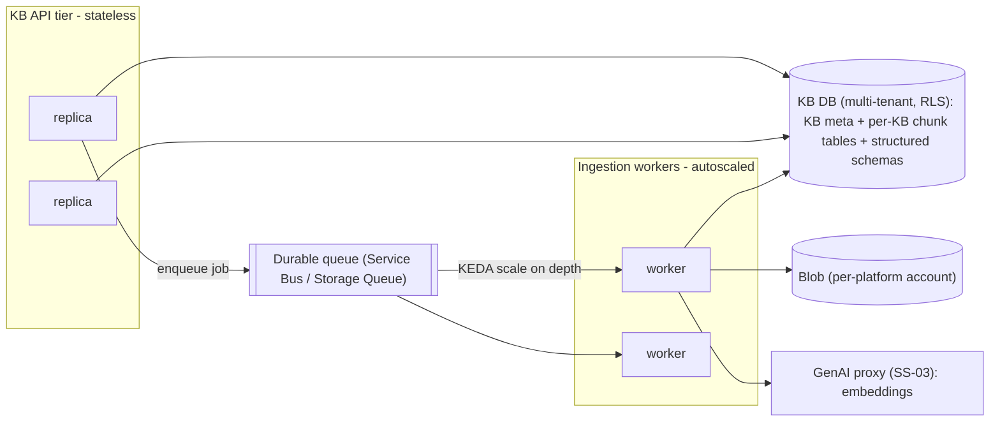
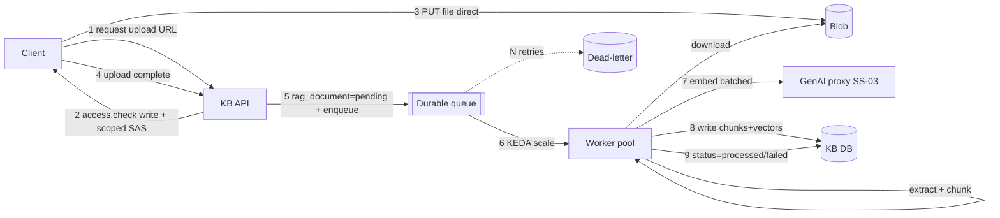
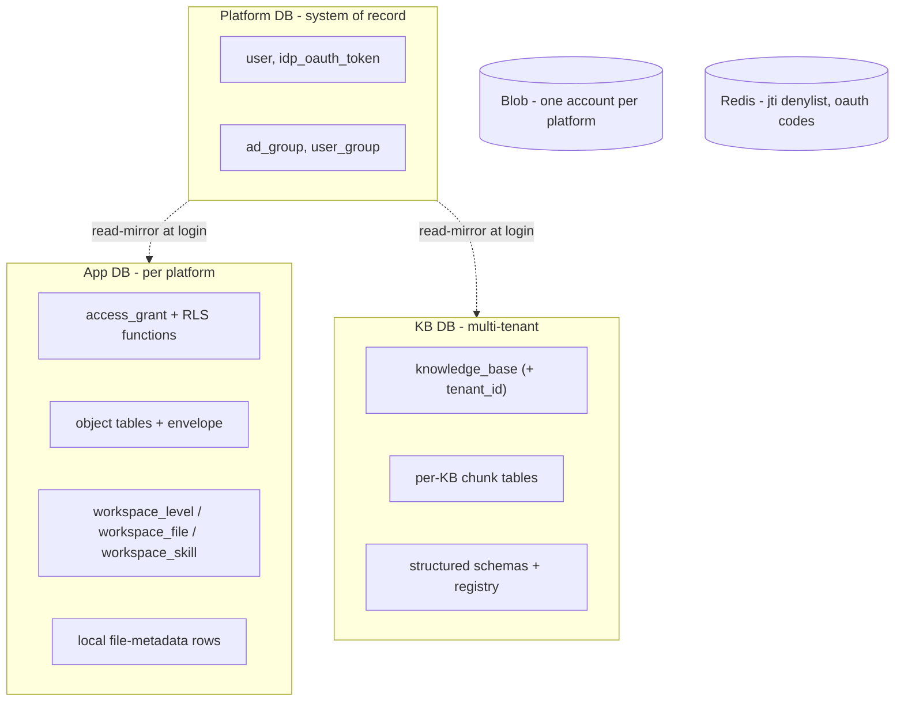
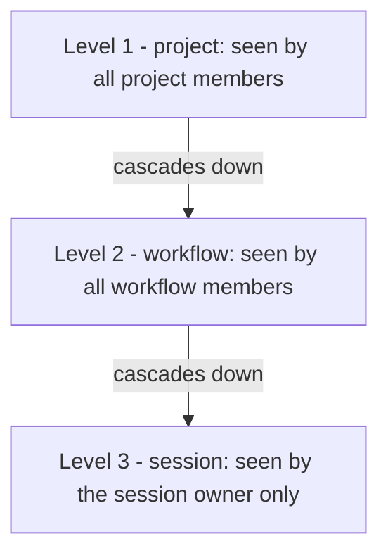

# Foundation Services & the Universal Sharing Framework

**Services covered:** SS-01 Identity & SSO · SS-02 User Directory · SS-05 Knowledge Base/RAG (standalone, multi-tenant, scalable) · SS-12 File/Blob Storage (standalone broker)
**Also defines:** the Universal Sharing Framework and the Shared Workspace (multi-level file/skill scoping).
**Audience:** engineers building *any* platform on top of this substrate.
**Status:** engineering standard (v2). Grounded in the current Apex implementation and generalized for reuse.

---

## 0. TL;DR — what this document gives you

1. Four **foundation services** you compose into every new platform instead of rebuilding auth, directory, retrieval, and storage. SS-05 (KB/RAG) and SS-12 (Storage) are **independently deployed, multi-tenant services** every platform calls — never re-implemented per app.
2. A **Universal Sharing Framework**: one polymorphic grant model + a set of reusable Postgres RLS functions so **any object** (a KB, a workflow, a dashboard, a dataset, a "widget", anything) becomes shareable **with users and groups** in ~7 steps and **zero bespoke authorization code**.
3. **Contracts** (tables, endpoints, SDK, RLS templates) that are stable across platforms so a share made in Platform A behaves identically in Platform B.
4. A **Shared Workspace** model: files and skills attach to a platform-configurable **level** (e.g. project / workflow / session) and inherit that scope's grants — so "everyone on the project sees this file" needs no new ACL.
5. Clear **service separation and data-placement rules** (which table lives in which database) so teams can implement each service independently and correctly.

The golden rule: **authorization is data (grants) enforced by the database (RLS), not scattered** `if` **statements.** Application code is the friendly first gate; RLS is the hard backstop.

---


## 1. Design principles (the engineering practice)


| #   | Principle                                                                                                                                                           | Why                                                |
| --- | ------------------------------------------------------------------------------------------------------------------------------------------------------------------- | -------------------------------------------------- |
| P1  | **Identity is a signature-only trust boundary.** Every service trusts a platform JWT; it does not re-implement login.                                               | One auth flow, no per-app MSAL.                    |
| P2  | **One principal namespace.** A *principal* is either a `user` (stable `azure_oid`) or a `group` (Entra group GUID). Everything shareable is granted to a principal. | Users and groups share one code path.              |
| P3  | **Authorization = data, not code.** Grants live in one table (`access_grant`); enforcement lives in RLS policies.                                                   | Any object is shareable without new authz logic.   |
| P4  | **Deny by default.** A row is visible only via *owner*, an *explicit grant*, or a declared *visibility scope*.                                                      | No accidental exposure.                            |
| P5  | **Two lines of defense.** API layer returns a friendly `403`; RLS is the unbypassable backstop (`FORCE ROW LEVEL SECURITY`, non-superuser role, `NOBYPASSRLS`).     | A forgotten `WHERE` clause cannot leak data.       |
| P6  | **Resource envelope.** Every shareable table carries the same 4 columns: `id`, `owner_id`, `resource_type`, `visibility`.                                           | RLS templates drop in unchanged.                   |
| P7  | **Never trust client identity.** `user_id` + group GUIDs are derived server-side from the validated JWT + directory, then stamped into DB session GUCs.             | Clients cannot spoof principals.                   |
| P8  | **Groups are resolved per-request, not from the JWT.** Enterprise users are in hundreds of groups; that blows past the ~8 KB ingress header limit.                  | Avoids post-login 401 loops.                       |
| P9  | **Storage access is brokered and gated.** No storage keys in clients; the broker issues short-lived, blob-scoped SAS only after an `access.check`.                  | Files inherit the same ACL as their owning object. |
| P10 | **Cascade from the parent.** Child objects (KB documents, file parts) inherit the parent's grants via RLS `EXISTS`, never their own copy of the ACL.                | One grant, consistent children.                    |
| P11 | **Heavy capabilities are standalone multi-tenant services.** KB/RAG (SS-05) and Storage (SS-12) run and scale independently, with their own DB/accounts; platforms call them over a contract, never embed them. | One retrieval/storage stack; scale where the load is. |
| P12 | **Blob-first, process-async.** Large payloads go straight to blob via scoped SAS; extraction/chunking/embedding run off a durable queue on an autoscaled worker pool. | Lean APIs, resilient ingestion, independent scaling. |
| P13 | **Workspace scoping is layered, not bespoke.** A file/skill attaches to a level `(scope_type, scope_id)` and inherits that resource's grants; higher levels cascade down. | Project/workflow/session sharing with zero new ACLs. |
| P14 | **Service-to-service calls are authenticated too.** Cross-service calls carry a machine (M2M) token *and* propagate the end-user identity, which the callee stamps into its own RLS GUCs. | Row-level truth survives service hops. |


---


## 2. System context




Identity establishes *who you are*; the Directory establishes *which groups you belong to*; the Sharing Framework decides *what you may see or change*; KB and Storage are two consumers of that framework (and templates for your own objects).

---


## 3. SS-01 — Identity & SSO Service


### 3.1 Responsibility

Single authentication & session authority. Wraps the IdP (Microsoft Entra), issues a **platform JWT** trusted by every service by **signature only**, and owns session lifecycle (refresh rotation + revocation).

### 3.2 Token contract (platform JWT)

```json
{
  "sub": "azure_oid-or-user-uuid",   // stable principal id — the ONLY identity claim services trust
  "app_id": "edwin",                  // which app minted/where the session lives (for policy & metering)
  "email": "jane@corp.com",
  "name": "Jane Doe",
  "sid": "server-session-id",         // for server-side revoke
  "type": "access",
  "iat": 1730000000,
  "exp": 1730003600
}
```

- **No** `groups` **claim.** Groups are looked up per-request from SS-02 (principle P8).
- **Algorithm:** HS256 (shared secret) today; **target is RS256/JWKS** so services validate with a public key and the signing key never leaves Identity. Contract for consumers is identical either way: *verify signature → read* `sub`.
- Refresh tokens carry a `jti`; revocation = denylist the `jti` (Redis), rotate on every refresh.


### 3.3 Tables (owned by Identity)

```sql
-- Canonical account (see SS-02 for the directory view)
CREATE TABLE "user" (
  id            VARCHAR(36) PRIMARY KEY,        -- = azure_oid in target
  email         VARCHAR(320) UNIQUE NOT NULL,
  "firstName"   VARCHAR(255),
  "lastName"    VARCHAR(255),
  "roleSlug"    VARCHAR(64),                    -- coarse platform role (e.g. '...admin...')
  disabled      BOOLEAN NOT NULL DEFAULT FALSE,
  "createdAt"   TIMESTAMPTZ NOT NULL DEFAULT now(),
  "lastActive"  TIMESTAMPTZ
);

-- Per-user encrypted IdP refresh token (for delegated Graph calls). Owner-only RLS, NO admin override.
CREATE TABLE idp_oauth_token (
  "userId"                 VARCHAR(36) PRIMARY KEY REFERENCES "user"(id) ON DELETE CASCADE,
  "refreshTokenEncrypted"  TEXT NOT NULL,        -- Fernet-wrapped; plaintext never stored
  scopes                   TEXT NOT NULL,
  "updatedAt"              TIMESTAMPTZ NOT NULL DEFAULT now()
);
```


### 3.4 Endpoints


| Method | Path               | Purpose                                                            |
| ------ | ------------------ | ------------------------------------------------------------------ |
| POST   | `/v1/auth/session` | Exchange IdP code (or credentials) → platform JWT + refresh cookie |
| POST   | `/v1/auth/refresh` | Rotate refresh token (new `jti`), issue new access token           |
| POST   | `/v1/auth/logout`  | Revoke session (`jti` denylist)                                    |
| GET    | `/v1/users/me`     | Current principal profile (from JWT)                               |


### 3.5 The one thing every other service must do

On every authenticated request: **verify the JWT, then seed the DB session GUCs** (§5.3). This is the bridge from Identity to RLS. In the current codebase this is `get_current_user` → `get_db_with_user_context` (`app/core/dependencies.py`).

---


## 4. SS-02 — User Directory Service


### 4.1 Responsibility

Canonical source of truth for **principals**: user records + the group graph. Eliminates per-app profile drift and provides the group membership that powers group shares.

### 4.2 Tables

```sql
-- Cache of Entra security groups (so we can render names without a Graph round-trip)
CREATE TABLE ad_group (
  id             VARCHAR(36) PRIMARY KEY,       -- group object id (GUID)
  "displayName"  VARCHAR(255),
  description    TEXT,
  "lastSyncedAt" TIMESTAMPTZ NOT NULL DEFAULT now()
);

-- Which groups each user belongs to (refreshed at login from the IdP)
CREATE TABLE user_group (
  "userId"  VARCHAR(36) NOT NULL REFERENCES "user"(id)   ON DELETE CASCADE,
  "groupId" VARCHAR(36) NOT NULL REFERENCES ad_group(id) ON DELETE CASCADE,
  "addedAt" TIMESTAMPTZ NOT NULL DEFAULT now(),
  PRIMARY KEY ("userId", "groupId")
);
CREATE INDEX idx_user_group_group ON user_group("groupId");
```


### 4.3 The `Principal` abstraction (the contract every consumer uses)

```json
{ "type": "user",  "id": "9f3c...oid", "displayName": "Jane Doe", "email": "jane@corp.com" }
{ "type": "group", "id": "a12b...guid", "displayName": "Deals-Analysts" }
```


### 4.4 Endpoints


| Method | Path                       | Purpose                                                               |
| ------ | -------------------------- | --------------------------------------------------------------------- |
| GET    | `/v1/users/{id}`           | Resolve a user principal                                              |
| GET    | `/v1/users/search?q=`      | User typeahead (local records)                                        |
| GET    | `/v1/groups/search?q=`     | Group typeahead (delegated Graph as the user + local cache fallback)  |
| GET    | `/v1/principals/me/groups` | Groups the caller belongs to (drives the "share with a group" picker) |


### 4.5 Group sync (login)

At login, call Graph **as the user** (delegated `GroupMember.Read.All`), upsert `ad_group`, and rebuild `user_group` for that user. Delegated (not app-only) avoids the broad tenant consent enterprises push back on. Group typeahead falls back to the local cache when Graph is unavailable.

---


## 5. The Universal Sharing Framework (the core)

Everything above exists so that **this** works generically.

### 5.1 Concepts

- **Resource** — anything shareable. Identified by `(resource_type, resource_id)`. `resource_type` is a short stable string per object kind (`"knowledge_base"`, `"workflow"`, `"dashboard"`, `"dataset"`, …).
- **Principal** — a `user` or a `group` (§4.3).
- **Grant** — a row saying *principal P has permission ≥ L on resource R*.
- **Permission ladder** — ordered: `read (1) < write (2) < manage (3)`. `owner` is derived from `resource.owner_id` and outranks all (level 3 + delete/transfer rights). Extensible via `conditions` (below).
- **Visibility scope** — resource-level broadcast without enumerating principals: `private` (default) · `org` (any authenticated org user gets read) · `public` (marketplace/anonymous read).


### 5.2 Canonical data model

Every shareable table embeds the **resource envelope**:

```sql
-- Drop these 4 columns onto ANY table you want shareable:
--   id           <pk>                       -- resource_id
--   owner_id     VARCHAR(36) NOT NULL       -- creator/owner principal (a user id)
--   resource_type is implicit per table (a constant string in policies), OR store it if a table is polymorphic
--   visibility   VARCHAR(16) NOT NULL DEFAULT 'private'
--                CHECK (visibility IN ('private','org','public'))
```

The **one grant table for the whole platform**:

```sql
CREATE TABLE access_grant (
  id                 VARCHAR(36) PRIMARY KEY,
  resource_type      VARCHAR(64)  NOT NULL,                 -- 'knowledge_base', 'workflow', 'dashboard', ...
  resource_id        VARCHAR(36)  NOT NULL,
  resource_owner_id  VARCHAR(36)  NOT NULL,                 -- DENORMALIZED: enables owner checks in RLS without a polymorphic FK
  principal_type     VARCHAR(10)  NOT NULL CHECK (principal_type IN ('user','group')),
  principal_id       VARCHAR(36)  NOT NULL,
  permission         VARCHAR(10)  NOT NULL DEFAULT 'read'
                       CHECK (permission IN ('read','write','manage')),
  conditions         JSONB,                                  -- optional: {"capabilities":["export"],"maxRows":1000,...}
  granted_by         VARCHAR(36)  NOT NULL,
  granted_at         TIMESTAMPTZ  NOT NULL DEFAULT now(),
  expires_at         TIMESTAMPTZ,                            -- optional time-boxed access
  UNIQUE (resource_type, resource_id, principal_type, principal_id)
);
CREATE INDEX idx_grant_resource  ON access_grant(resource_type, resource_id);
CREATE INDEX idx_grant_principal ON access_grant(principal_type, principal_id);
CREATE INDEX idx_grant_owner     ON access_grant(resource_owner_id);
```

**Why one polymorphic table (not one** `*_share` **table per object):** a new object type in any platform reuses the exact same grant plumbing, API, SDK, "shared-with-me" feed, and audit — no new tables, no new endpoints. (The current Apex code uses per-resource `workflow_share` / `knowledge_base_share`; §12 maps that to this model and offers a compatibility view.)

**Why** `resource_owner_id` **is denormalized onto the grant:** RLS on `access_grant` itself must answer "are you the owner of the thing this grant is about?" without joining to a table it can't name at policy-compile time. Storing the owner on the grant keeps grant-table RLS simple and fast. Keep it in sync on ownership transfer (trigger or the Sharing Service).

### 5.3 Session context (GUCs)

RLS reads two connection settings, seeded once per request **after** JWT validation:

```sql
SET app.current_user_id     = '<user uuid>';        -- the principal
SET app.current_user_groups = '<guid1>,<guid2>,...'; -- CSV of the user's group GUIDs (from user_group)
```

Reset them before returning the connection to the pool. Reference implementation: `set_user_context()` in `app/db/pgsql.py`, invoked by `get_db_with_user_context()`.

> **Security note:** these are set from server-derived values only, using validated UUIDs (reject malformed ids). Never set them from a raw client header or a `groups` JWT claim.


### 5.4 Reusable RLS helper functions (install once per database)

```sql
-- CSV GUC -> TEXT[] of group ids (empty array when unset / system context)
CREATE OR REPLACE FUNCTION app_current_user_groups() RETURNS TEXT[] AS $$
BEGIN
  RETURN string_to_array(NULLIF(current_setting('app.current_user_groups', true), ''), ',');
EXCEPTION WHEN OTHERS THEN
  RETURN ARRAY[]::TEXT[];
END;
$$ LANGUAGE plpgsql STABLE;

-- The one function every policy calls. Returns the caller's effective level on a resource:
--   0 = none, 1 = read, 2 = write, 3 = manage/owner
CREATE OR REPLACE FUNCTION app_effective_level(
  p_resource_type text,
  p_resource_id   text,
  p_owner_id      text,
  p_visibility    text
) RETURNS int LANGUAGE sql STABLE AS $$
  SELECT GREATEST(
    -- owner outranks everything
    CASE WHEN p_owner_id = current_setting('app.current_user_id', true) THEN 3 ELSE 0 END,
    -- visibility broadcast grants read
    CASE WHEN p_visibility IN ('public','org') THEN 1 ELSE 0 END,
    -- explicit user/group grants (honor expiry)
    COALESCE((
      SELECT MAX(CASE g.permission WHEN 'manage' THEN 3 WHEN 'write' THEN 2 WHEN 'read' THEN 1 ELSE 0 END)
      FROM access_grant g
      WHERE g.resource_type = p_resource_type
        AND g.resource_id   = p_resource_id
        AND (g.expires_at IS NULL OR g.expires_at > now())
        AND (
             (g.principal_type = 'user'  AND g.principal_id = current_setting('app.current_user_id', true))
          OR (g.principal_type = 'group' AND g.principal_id = ANY(app_current_user_groups()))
        )
    ), 0)
  );
$$;

-- Convenience wrappers (optional)
CREATE OR REPLACE FUNCTION app_can_read (rt text, rid text, owner text, vis text) RETURNS boolean
  LANGUAGE sql STABLE AS $$ SELECT app_effective_level(rt,rid,owner,vis) >= 1 $$;
CREATE OR REPLACE FUNCTION app_can_write(rt text, rid text, owner text, vis text) RETURNS boolean
  LANGUAGE sql STABLE AS $$ SELECT app_effective_level(rt,rid,owner,vis) >= 2 $$;
```


### 5.5 The drop-in RLS policy template

To make **any** table `foo` shareable, ensure it has `id`, `owner_id`, `visibility`, pick a `resource_type` string (`'foo'`), and apply:

```sql
ALTER TABLE foo ENABLE ROW LEVEL SECURITY;
ALTER TABLE foo FORCE  ROW LEVEL SECURITY;   -- applies even to the table owner role

-- SELECT: owner OR visibility OR any grant (>= read)
CREATE POLICY foo_select ON foo FOR SELECT
  USING ( app_effective_level('foo', id::text, owner_id::text, visibility) >= 1 );

-- INSERT: you may only create rows you own (app still sets owner_id = caller)
CREATE POLICY foo_insert ON foo FOR INSERT
  WITH CHECK ( owner_id::text = current_setting('app.current_user_id', true) );

-- UPDATE: owner OR a 'write'/'manage' grant (>= write)
CREATE POLICY foo_update ON foo FOR UPDATE
  USING ( app_effective_level('foo', id::text, owner_id::text, visibility) >= 2 );

-- DELETE: owner only
CREATE POLICY foo_delete ON foo FOR DELETE
  USING ( owner_id::text = current_setting('app.current_user_id', true) );
```

That is the entire authorization surface for a new object. No application authz code required for row visibility.

### 5.6 Child objects inherit the parent (cascade)

Children (e.g. a document inside a KB, a page inside a dashboard) do **not** get their own grants. Their RLS references the parent:

```sql
-- rag_document inherits knowledge_base access
CREATE POLICY doc_select ON rag_document FOR SELECT
  USING ( EXISTS (
    SELECT 1 FROM knowledge_base kb
    WHERE kb.id = rag_document."kbId"
      AND app_effective_level('knowledge_base', kb.id::text, kb.owner_id::text, kb.visibility) >= 1
  ) );
```


### 5.7 RLS on `access_grant` itself

```sql
ALTER TABLE access_grant ENABLE ROW LEVEL SECURITY;
ALTER TABLE access_grant FORCE  ROW LEVEL SECURITY;

-- SELECT: resource owner, the grantee (user or via group), or a platform admin
CREATE POLICY grant_select ON access_grant FOR SELECT USING (
     resource_owner_id = current_setting('app.current_user_id', true)
  OR (principal_type = 'user'  AND principal_id = current_setting('app.current_user_id', true))
  OR (principal_type = 'group' AND principal_id = ANY(app_current_user_groups()))
  OR EXISTS (SELECT 1 FROM "user" u
             WHERE u.id = current_setting('app.current_user_id', true)
               AND u."roleSlug" LIKE '%admin%')
);

-- INSERT/UPDATE/DELETE: only the resource owner (or admin) may manage grants
CREATE POLICY grant_write ON access_grant FOR ALL USING (
     resource_owner_id = current_setting('app.current_user_id', true)
  OR EXISTS (SELECT 1 FROM "user" u
             WHERE u.id = current_setting('app.current_user_id', true)
               AND u."roleSlug" LIKE '%admin%')
) WITH CHECK (
     resource_owner_id = current_setting('app.current_user_id', true)
  OR EXISTS (SELECT 1 FROM "user" u
             WHERE u.id = current_setting('app.current_user_id', true)
               AND u."roleSlug" LIKE '%admin%')
);
```

> **Delegated share management (**`manage`**)** — allowing non-owners with a `manage` grant to add/remove shares is an *advanced* option. Because evaluating it inside `access_grant`'s own policy is self-referential, do it via a `SECURITY DEFINER` helper (`app_can_manage(rt, rid)`) rather than an inline subquery. Start owner/admin-only; add `manage` when you truly need it.


### 5.8 Permission model & extensibility

- **Ladder** covers 90% of cases: `read` (consume), `write` (edit/contribute), `manage` (edit + share).
- `conditions` **JSONB** covers the rest without schema churn: capability subsets (`{"capabilities":["export","download"]}`), row/quota caps, time windows, IP constraints. The application reads `conditions` after RLS has admitted the row; keep RLS itself about the coarse ladder for performance.
- **Custom actions** map to a capability in `conditions`, not a new column.


### 5.9 Optional: approval workflow hook

Some grants are sensitive (sharing to a whole group, or to 16+ users at once, or making something `public`). The Sharing Service supports an **approval gate**: instead of writing the grant immediately, it creates a pending *submission* that an admin approves; the grant is written on approval. This mirrors the current `MarketplaceSubmission` share-approval flow. Make it a policy toggle per `resource_type`.

---


## 6. Sharing Service — API & SDK contract


### 6.1 REST API (stable across platforms)


| Method | Path                                   | Body / Query                                                                                  | Result                                                        |
| ------ | -------------------------------------- | --------------------------------------------------------------------------------------------- | ------------------------------------------------------------- |
| POST   | `/v1/shares`                           | `{resourceType, resourceId, principalType, principalId, permission, expiresAt?, conditions?}` | `201` grant, or `202` pending-approval                        |
| GET    | `/v1/shares`                           | `?resourceType=&resourceId=`                                                                  | `{ grants: Grant[], pending: Pending[] }` (owner/manage only) |
| PATCH  | `/v1/shares/{id}`                      | `{permission?, expiresAt?}`                                                                   | updated grant                                                 |
| DELETE | `/v1/shares/{id}`                      | —                                                                                             | `204`                                                         |
| GET    | `/v1/access/check`                     | `?resourceType=&resourceId=&action=read                                                       | write                                                         |
| POST   | `/v1/access/check:batch`               | `{ items: [{resourceType,resourceId,action}] }`                                               | `[{allowed, level}]`                                          |
| GET    | `/v1/shared-with-me`                   | `?resourceType=&minPermission=write`                                                          | list of `{resourceType, resourceId, permission, via}`         |
| PATCH  | `/v1/resources/{type}/{id}/visibility` | `{visibility}`                                                                                | updated (owner/manage)                                        |
| GET    | `/v1/principals/search`                | `?q=&type=user                                                                                | group`                                                        |


**Grant object**

```json
{
  "id": "b1e2...",
  "resourceType": "dashboard",
  "resourceId": "d-8842",
  "principalType": "group",
  "principalId": "a12b...guid",
  "principalDisplayName": "Deals-Analysts",
  "permission": "read",
  "expiresAt": null,
  "grantedBy": "9f3c...oid",
  "grantedAt": "2026-07-21T10:00:00Z"
}
```


### 6.2 "Shared with me" semantics

Return resources where the caller (directly or via a group) holds a grant `>= minPermission`, excluding ones they own. Dedupe by resource (prefer the highest permission when reached via multiple principals). This is the generalized form of the current `/api/sharing/shared-with-me/*` endpoints.

### 6.3 SDK / in-process contract

A dedicated sharing-client SDK is not published yet — services integrate over the HTTP API above. When the SDK ships, it will live under [`sdks/`](https://github.com/pwc-me-adv-strategyand/infra-platform-services/tree/main/sdks) and be documented on the [docs site](https://pwc-me-adv-strategyand.github.io/infra-platform-services/).


### 6.4 API vs RLS responsibilities

- **API layer**: friendly errors (`404` vs `403`), ownership checks for share management, input validation (UUIDs), approval gating, display-name hydration.
- **RLS**: the actual row-level truth. Even if the API has a bug, RLS does not return rows the caller may not see. (This is why `FORCE ROW LEVEL SECURITY` + a **non-superuser** app role + `NOBYPASSRLS` are mandatory — a superuser silently bypasses RLS.)

---


## 7. Make any object shareable — the 7-step checklist

1. **Add the envelope** to your table: `owner_id VARCHAR(36) NOT NULL`, `visibility VARCHAR(16) NOT NULL DEFAULT 'private'`. Keep your existing `id`.
2. **Pick a** `resource_type` string (e.g. `'dashboard'`). Use it consistently everywhere.
3. **Apply the RLS template** (§5.5) with that `resource_type`.
4. **Set** `owner_id = caller` on create (the app writes it; the INSERT `WITH CHECK` enforces it).
5. **Wire share management** to the Sharing Service (`POST/GET/DELETE /v1/shares`) — no custom tables.
6. **Cascade children** (if any) with a parent `EXISTS` policy (§5.6).
7. **Gate storage** (if the object has files) through the SAS broker with an `access.check` (§8).

Done — your object now supports owner + user shares + group shares + public/org visibility + "shared-with-me" + audit, identical to KBs and workflows.

### Worked example — a brand-new `dashboard` object in another platform

```sql
CREATE TABLE dashboard (
  id          VARCHAR(36) PRIMARY KEY,
  title       TEXT NOT NULL,
  spec        JSONB NOT NULL,
  owner_id    VARCHAR(36) NOT NULL,
  visibility  VARCHAR(16) NOT NULL DEFAULT 'private'
              CHECK (visibility IN ('private','org','public'))
);

ALTER TABLE dashboard ENABLE ROW LEVEL SECURITY;
ALTER TABLE dashboard FORCE  ROW LEVEL SECURITY;

CREATE POLICY dashboard_select ON dashboard FOR SELECT
  USING ( app_effective_level('dashboard', id::text, owner_id::text, visibility) >= 1 );
CREATE POLICY dashboard_insert ON dashboard FOR INSERT
  WITH CHECK ( owner_id::text = current_setting('app.current_user_id', true) );
CREATE POLICY dashboard_update ON dashboard FOR UPDATE
  USING ( app_effective_level('dashboard', id::text, owner_id::text, visibility) >= 2 );
CREATE POLICY dashboard_delete ON dashboard FOR DELETE
  USING ( owner_id::text = current_setting('app.current_user_id', true) );
```

Share it with a group:

```http
POST /v1/shares
{ "resourceType":"dashboard", "resourceId":"d-8842",
  "principalType":"group", "principalId":"a12b-...-guid", "permission":"read" }
```

Every analyst in `Deals-Analysts` can now `SELECT` that dashboard — enforced by the database, with no change to the dashboard service's query code.

---


## 8. SS-12 — File/Blob Storage (access-gated)


SS-12 is a **standalone, thin service**: a secure access broker for object storage plus a set of conventions. It does **not** own file business-metadata (see 8.5) — its value is safe, gated, key-free blob access that every platform reuses.

### 8.1 Responsibility & principles

- **Broker, not a store of record.** SS-12 mints short-lived, blob-scoped SAS after an `access.check`; it never returns account keys and never becomes a metadata registry.
- **No keys in clients.** The broker issues **short-lived, blob-scoped SAS** (read or write), preferably via a **user-delegation key** under Managed Identity (falls back to account key only for local Azurite dev). Reference: `generate_scoped_sas()` in `app/connectors/azure_storage_connector.py`.
- **Same ACL as the owning object.** A blob is reachable iff the caller can read/write its owning `(resource_type, resource_id)` — enforced via the Sharing Framework, not a second file-ACL system.
- **Blob-first.** Clients upload/download directly to blob via SAS; large bytes never stream through the API.

### 8.2 Topology

| Concern | Decision |
| --- | --- |
| Account | **One storage account per platform / ALZ** (blast-radius + quota isolation) |
| Container | **Per app/tenant** (`apex-*`, `edwin-*`, `platform-*`); optionally per-tenant containers for hard isolation |
| Auth | **Managed Identity** + user-delegation SAS in cloud; connection string only for local Azurite |
| Network | **Private endpoints**, public access disabled |
| Durability | **GRS/ZRS**, soft-delete + versioning + lifecycle rules (cold/expiry) |
| Encryption | Service-side encryption; optional CMK per platform |


### 8.3 Object-key convention — bind blobs to a resource

```
{app_id}/{resource_type}/{resource_id}/{filename}
# e.g.  edwin/knowledge_base/kb-123/report.pdf
```

This makes every blob traceable to an `(resource_type, resource_id)` so the broker can authorize it with the **same** grant model.

### 8.4 Broker endpoints (gated by the Sharing Framework)


| Method | Path                       | Body                               | Behavior                                                     |
| ------ | -------------------------- | ---------------------------------- | ------------------------------------------------------------ |
| POST   | `/v1/storage/upload-url`   | `{resourceType, resourceId, path}` | `access.check(rt, rid, 'write')` → issue write SAS (≤15 min) |
| POST   | `/v1/storage/download-url` | `{resourceType, resourceId, path}` | `access.check(rt, rid, 'read')` → issue read SAS (≤15 min)   |


**SDK integration:** the broker calls `access.check` via the sharing client before issuing SAS. A published storage client SDK will live under [`sdks/`](https://github.com/pwc-me-adv-strategyand/infra-platform-services/tree/main/sdks) when it ships.

Result: a file is readable **iff** the caller can read its owning object. Sharing a KB with a group instantly makes that KB's documents downloadable by the group — no separate file ACL.

### 8.5 Metadata ownership — broker + local metadata (and why)

SS-12 stores **no business-metadata rows**. Each platform/app keeps its own file records (`chat_file`, `rag_document`, …) in its own DB. Rationale:

- **One RLS path.** A file row lives beside its parent, so a single local `EXISTS` policy authorizes it — no cross-service call on every list.
- **Transactional integrity.** Object + file record commit in one transaction; no distributed "object exists but file doesn't" states.
- **Autonomy.** File schemas differ per platform (`chat_file.messageId` vs `rag_document` chunk status); a central schema becomes a sparse lowest-common-denominator and a shared SPOF.

**When you *do* want a central index** (org-wide dedupe/DLP/e-discovery), add a **thin catalog** later — pointer + content-hash + tenant only — fed by blob events, **without** moving ownership.

### 8.6 Failure modes & lifecycle

- **SAS expiry mid-transfer** → client re-requests a URL (idempotent); keep expiries short (≤15 min).
- **Orphaned blobs** (row deleted, blob remains) → lifecycle rule + a periodic reconciler keyed by the object-key convention.
- **Broker down** → uploads/downloads pause, but existing rows and RLS are unaffected; no data exposure.

---


## 9. SS-05 — Knowledge Base / RAG Service (standalone, multi-tenant, scalable)

KB/RAG is a **first-class, independently deployed service** that every platform calls — never re-implemented per app. It is also the **reference consumer** of the Sharing Framework: a KB is just a shareable object (`resource_type='knowledge_base'`) whose documents inherit its grants.

### 9.1 Responsibility & why standalone

One retrieval stack for the whole org: ingest documents/datasets, chunk + embed, and serve hybrid (semantic + keyword) + structured retrieval. It runs standalone because its load profile (heavy CPU/RAM for parsing/embedding, large vector indexes) is completely different from a typical app API, and because every platform needs the *same* retrieval quality and contract.

### 9.2 Deployment & scaling pattern



- **Stateless API replicas** scale horizontally behind the platform ingress.
- **Ingestion workers** are a separate pool, autoscaled on **queue depth** (KEDA). Heavy parsers/embedders live only here, keeping the API lean (grounded in today's `document_process_worker.py`, promoted from an in-process subprocess to a queue-driven pool).
- **Its own DB** (see 9.4) scales independently (vertical + read replicas for search).

### 9.3 Service identity — M2M + propagated end-user (how identity is verified)

A platform calls KB with **two** credentials and KB stamps the end-user identity into its own RLS GUCs:

```mermaid
sequenceDiagram
  participant FE as Platform app
  participant KB as KB service
  participant IDP as Identity SS-01
  participant DB as KB DB RLS
  FE->>KB: request + user JWT + M2M service token
  KB->>KB: verify M2M token (caller allowed?) 
  KB->>IDP: verify user JWT signature (JWKS / shared secret)
  KB->>KB: derive user_id, tenant_id; load groups (mirror)
  KB->>DB: SET app.current_user_id / _groups / _tenant_id
  DB-->>KB: rows filtered by RLS (tenant + grants)
  KB-->>FE: results (only what the user may see)
```

- **M2M token** (client-credentials, e.g. Entra app or signed service JWT) proves *which platform* is calling and gates the service surface.
- **Propagated user context** (the end-user platform JWT, verified by signature) yields `sub`/`tenant_id`; KB seeds `app.current_user_id`, `app.current_user_groups`, `app.current_tenant_id` so **row-level truth survives the service hop** (principle P14). Never trust a caller-supplied user id without the signed JWT.

### 9.4 Data model (KB DB) — and how tables are created

The KB service owns its **own multi-tenant database**, isolated by `tenant_id` + RLS.

```sql
-- KB metadata (one row per KB) — a shareable object with the resource envelope
CREATE TABLE knowledge_base (
  id               VARCHAR(36) PRIMARY KEY,
  tenant_id        VARCHAR(64) NOT NULL,             -- platform/tenant isolation
  name             VARCHAR(255) NOT NULL,
  owner_id         VARCHAR(36) NOT NULL,             -- envelope (was createdBy)
  visibility       VARCHAR(16) NOT NULL DEFAULT 'private',   -- was isPublic
  embedding_model  VARCHAR(64) NOT NULL,             -- per-KB model...
  vector_dimension INTEGER NOT NULL,                 -- ...and dimension (kept flexible)
  chunk_table_name VARCHAR(128) NOT NULL UNIQUE,     -- name of this KB's chunk table
  chunking_config  JSONB NOT NULL,
  metadata_schema  JSONB,                            -- typed fields for metadata filters
  has_structured   BOOLEAN NOT NULL DEFAULT FALSE,
  status           VARCHAR(20) NOT NULL DEFAULT 'creating',
  created_at       TIMESTAMPTZ NOT NULL DEFAULT now()
);

-- Documents (blob-first): row created BEFORE processing, then status transitions
CREATE TABLE rag_document (
  id             VARCHAR(36) PRIMARY KEY,
  kb_id          VARCHAR(36) NOT NULL REFERENCES knowledge_base(id) ON DELETE CASCADE,
  tenant_id      VARCHAR(64) NOT NULL,
  blob_name      VARCHAR(512) NOT NULL,             -- {tenant}/knowledge_base/{kb_id}/{doc_id}/{file}
  file_name      VARCHAR(255) NOT NULL,
  file_type      VARCHAR(50)  NOT NULL,
  status         VARCHAR(30)  NOT NULL DEFAULT 'pending',   -- pending->processing->processed/failed
  processing_error TEXT
);
```

**How the two kinds of tables are created:**

- **Unstructured — per-KB chunk table (dynamic).** On KB create (async, `status='creating'`), the service `CREATE TABLE {chunk_table_name}` with `kb_id`, `document_id`, `chunk_text`, a generated `chunk_text_tsv tsvector`, `embedding vector(dim)`, `metadata JSONB`, plus indexes: `vchordrq` (per `VECTOR_INDEX_TYPE`) on `embedding`, GIN on `chunk_text_tsv`, GIN on `metadata jsonb_path_ops`, b-tree on `kb_id`/`document_id`, and typed expression indexes for declared metadata fields. (Exactly today's `create_chunk_table()`.)
- **Structured — dynamic schema/typed tables.** CSV/XLSX/DB sources are ingested into **dynamically created typed tables/schemas** (columns match the source), registered in a `structured_dataset` catalog and queried via metadata filters / text-to-SQL — *not* chunked into vectors.

> **Chunk-storage decision:** keep **per-KB chunk tables** (target scale ~1k KBs ≈ ~5k relations, well within Postgres limits). Advantages: **perfect index locality** (each `vchordrq` index holds one KB's vectors, so `WHERE kb_id=…` is exact and there is *no* filtered-ANN recall problem), **per-KB embedding model/dimension** preserved, and **instant `DROP TABLE`** on delete. Guardrails: soft ceiling of a few thousand chunk tables (revisit consolidation/partitioning beyond it); do the `CREATE TABLE/INDEX` in the async create flow; provide a **migration runner that loops all chunk tables** (idempotent) since `create_all` won't touch them; monitor catalog size + autovacuum.

### 9.5 Structured vs unstructured data

| | Unstructured (docs) | Structured (CSV/XLSX/DB) |
| --- | --- | --- |
| Pipeline | extract → chunk → embed | load into typed table/schema |
| Store | per-KB chunk table (vectors + tsvector) | dynamic typed tables + `structured_dataset` registry |
| Retrieval | hybrid (semantic + BM25 + rerank) | metadata filters / text-to-SQL / aggregates |
| Exposed via | `POST /v1/kb/{id}/search` | `POST /v1/kb/{id}/query` (structured) |

Both are addressable in one KB and can be combined (e.g. metadata-filtered semantic search using the JSONB `metadata` + typed expression indexes).

### 9.6 Ingestion pipeline (blob-first, process-async)



1–3. Client asks KB for an upload URL; KB verifies **write** access and returns a scoped SAS for `{tenant}/knowledge_base/{kb_id}/{doc_id}/{file}`; client uploads **directly to blob**.
4–5. Client (or a Blob "Created" event) signals completion; KB writes `rag_document status=pending` and enqueues `{tenant, kb_id, doc_id, blob, config}`.
6–9. A worker downloads → extracts → chunks → embeds (batched via GenAI proxy) → writes chunks → `processed` (or `failed` + error). **Idempotent per `doc_id`** (delete-then-insert chunks) so retries are safe; after N attempts → **dead-letter** for reprocessing.

### 9.7 Retrieval & enforcement

- `POST /v1/kb/{id}/search` runs under the caller's GUC context (`tenant_id` + `user_id` + groups). Tenant isolation is enforced by RLS on `knowledge_base`; a KB's chunk table is only queried after the service has resolved and **authorized** that KB (owner / grant / visibility via `access_grant`), so cross-tenant/cross-KB leakage is impossible.
- Hybrid search = semantic (`vchordrq`, cosine `<=>`) + BM25 (`ts_rank_cd` over `chunk_text_tsv`) fused with RRF, optional rerank — as implemented in `knowledge_base_repository.py`.

### 9.8 Cross-platform sharing

A KB is **platform-scoped by default**. To reuse one across platforms, create an `access_grant` (`resource_type='knowledge_base'`) for the target platform's principal/tenant — no data copy, same RLS path. Documents inherit via the parent `EXISTS` policy (§5.6).

### 9.9 Endpoints

| Method | Path | Purpose |
| --- | --- | --- |
| POST | `/v1/kb` | Create KB (async; provisions chunk table) |
| GET | `/v1/kb/{id}` | KB metadata (RLS-filtered) |
| POST | `/v1/kb/{id}/documents/upload-url` | Blob-first: access.check + scoped SAS |
| POST | `/v1/kb/{id}/documents` | Register uploaded doc + enqueue processing |
| POST | `/v1/kb/{id}/search` | Hybrid unstructured retrieval |
| POST | `/v1/kb/{id}/query` | Structured query (metadata / text-to-SQL) |
| GET | `/v1/kb/{id}/documents/{doc}/status` | Ingestion status |

All authorization comes free from the Sharing Framework; identity is verified per 9.3.

---


## 10. Service topology & data placement (which table lives where)

**Governing constraint:** Postgres RLS can only join tables **in the same database**, and a policy that checks admin/owner reads the local `user` row. Group membership is the exception — it travels in the `app.current_user_groups` GUC, so it needs no local join. Therefore: **identity & directory are mastered centrally and mirrored read-only into each service DB; every object's `access_grant` + RLS live co-located with the object.**



**Placement table**

| Table / asset | Where | Why |
| --- | --- | --- |
| `user`, `idp_oauth_token` | **Platform DB** (SoR); read-mirror into app/KB DBs | SS-01 owns identity; local copy needed for RLS admin/owner checks |
| `ad_group`, `user_group` | **Platform DB** (SoR); read-mirror | SS-02 owns the directory; used to build the group GUC + pickers |
| `access_grant` + RLS functions | **App DB** (each platform) | RLS `EXISTS`/`app_effective_level()` must reach it in-DB |
| Object tables + envelope | **App DB** | the protected objects live with their ACL |
| `workspace_level` / `workspace_file` / `workspace_skill` | **App DB** | scope resources (project/workflow/session) are app-local |
| Local file-metadata rows (`chat_file`, …) | **App DB** | co-located with the parent object (§8.5) |
| `knowledge_base` + per-KB chunk tables + structured schemas | **KB DB** (multi-tenant) | SS-05 scales independently |
| Blobs | **Per-platform storage account** | SS-12 topology (§8.2) |
| `jti` denylist, OAuth codes | **Redis** | short-lived, non-relational |

**Rule of thumb:** *Identity & directory = Platform DB (mastered), mirrored read-only into each service DB. Objects, their `access_grant`, and the RLS functions = co-located in the DB that serves them.* The directory read-mirror exists because RLS runs *inside* each DB and needs local `user` (admin/owner) and `user_group` (to seed the group GUC); membership at query time flows via the GUC, so there is no cross-DB join.

---

## 11. Shared Workspace — layered file & skill scoping

Files and skills used by agents attach to a **level** (a scope). Levels are **configured per platform** as an ordered list, and a platform enables **any subset** (only L1; or L1+L3; or L2+L3; …). Example labels — project (L1), workflow (L2), session (L3) — are configurable; only the *ordering* is fixed.



### 11.1 Core idea — reuse existing grants, don't invent membership

A level **maps onto an existing resource row** (a project / workflow / session is already a shareable object with `access_grant`). A workspace file/skill just carries `(scope_type, scope_id)` and **inherits that resource's grants** — no new membership tables. This composes with (does not replace) the Sharing Framework.

- **L1 (project):** visible to everyone who can read the project.
- **L2 (workflow):** visible to everyone who can read the workflow.
- **L3 (session):** visible to the **session owner only** (sessions are single-user today).
- **Downward cascade:** a higher-level asset is available in lower contexts (a project file is usable in that project's workflows/sessions); a session asset stays isolated to the session.

### 11.2 Tables (App DB)

```sql
-- Per-platform level configuration (ordered; enable any subset)
CREATE TABLE workspace_level (
  platform_id          VARCHAR(64) NOT NULL,
  level_no             INTEGER     NOT NULL,        -- 1 = broadest
  key                  VARCHAR(32) NOT NULL,        -- 'project' | 'workflow' | 'session' | custom
  label                VARCHAR(64) NOT NULL,        -- display label (renamable)
  scope_resource_type  VARCHAR(64) NOT NULL,        -- resource_type this level maps to
  enabled              BOOLEAN     NOT NULL DEFAULT TRUE,
  PRIMARY KEY (platform_id, level_no)
);

-- A file attached at some level. scope_type/scope_id point at an EXISTING resource row.
CREATE TABLE workspace_file (
  id          VARCHAR(36) PRIMARY KEY,
  scope_type  VARCHAR(64) NOT NULL,     -- e.g. 'project' | 'workflow' | 'session'
  scope_id    VARCHAR(36) NOT NULL,     -- the project/workflow/session id
  owner_id    VARCHAR(36) NOT NULL,
  blob_name   VARCHAR(512) NOT NULL,    -- {app}/{scope_type}/{scope_id}/{file}
  file_name   VARCHAR(255) NOT NULL,
  created_at  TIMESTAMPTZ NOT NULL DEFAULT now()
);
CREATE INDEX idx_ws_file_scope ON workspace_file(scope_type, scope_id);

-- Skills follow the SAME scoping model
CREATE TABLE workspace_skill (
  id          VARCHAR(36) PRIMARY KEY,
  scope_type  VARCHAR(64) NOT NULL,
  scope_id    VARCHAR(36) NOT NULL,
  owner_id    VARCHAR(36) NOT NULL,
  name        VARCHAR(255) NOT NULL,
  spec        JSONB NOT NULL,
  created_at  TIMESTAMPTZ NOT NULL DEFAULT now()
);
CREATE INDEX idx_ws_skill_scope ON workspace_skill(scope_type, scope_id);
```

### 11.3 RLS — inherit the scope's grants (with a session carve-out)

Because the scope is polymorphic (project/workflow/session), delegate the read-check to one `SECURITY DEFINER` helper that does the per-type lookup and reuses `app_effective_level` (owner/grant/visibility). Session scope is owner-only.

```sql
-- True if the caller may READ the given scope resource. SECURITY DEFINER so it can
-- consult the scope tables regardless of their own RLS; it performs its own check.
CREATE OR REPLACE FUNCTION app_can_read_scope(p_scope_type text, p_scope_id text)
RETURNS boolean LANGUAGE plpgsql STABLE SECURITY DEFINER AS $$
DECLARE ok boolean := false;
BEGIN
  IF p_scope_type = 'session' THEN
    SELECT s.owner_id::text = current_setting('app.current_user_id', true)
      INTO ok FROM chat_session s WHERE s.id = p_scope_id;           -- owner-only (L3)
  ELSIF p_scope_type = 'workflow' THEN
    SELECT app_effective_level('workflow', w.id::text, w.owner_id::text, w.visibility) >= 1
      INTO ok FROM workflow_entity w WHERE w.id = p_scope_id;
  ELSIF p_scope_type = 'project' THEN
    SELECT app_effective_level('project', p.id::text, p.owner_id::text, p.visibility) >= 1
      INTO ok FROM project p WHERE p.id = p_scope_id;
  END IF;
  RETURN COALESCE(ok, false);
END;
$$;

ALTER TABLE workspace_file ENABLE ROW LEVEL SECURITY;
ALTER TABLE workspace_file FORCE  ROW LEVEL SECURITY;

CREATE POLICY ws_file_select ON workspace_file FOR SELECT
  USING ( app_can_read_scope(scope_type, scope_id) );
CREATE POLICY ws_file_insert ON workspace_file FOR INSERT
  WITH CHECK ( owner_id::text = current_setting('app.current_user_id', true)
               AND app_can_read_scope(scope_type, scope_id) );
CREATE POLICY ws_file_delete ON workspace_file FOR DELETE
  USING ( owner_id::text = current_setting('app.current_user_id', true) );
-- (same three policies for workspace_skill)
```

> `owner_id`/`visibility` above are the envelope names; in current Apex they map to `project.userId`, `workflow_entity.createdById`/`isPublic`, and `chat_session.userId`. Add the envelope aliases when adopting.

### 11.4 Downward cascade at query time

"Visible if you can read the scope it's attached to" gives the correct per-row rule. **Cascade** is achieved by querying the **ancestor chain** of the current context: when an agent runs in session `S` (under workflow `W`, project `P`), list assets where `(scope_type, scope_id)` ∈ {(project,P), (workflow,W), (session,S)} — RLS then confirms read on each.

```sql
-- Effective files for a session context (project ∪ workflow ∪ session), RLS-filtered
SELECT * FROM workspace_file
WHERE (scope_type,scope_id) IN (('project',:p),('workflow',:w),('session',:s));
```

### 11.5 Level semantics

| Level | Example key | Scope resource | Who sees its files/skills |
| --- | --- | --- | --- |
| L1 | `project` | `project` row | anyone with read on the project (owner + grants + visibility) |
| L2 | `workflow` | `workflow_entity` row | anyone with read on the workflow |
| L3 | `session` | `chat_session` row | the session owner only |

A platform enabling only L1+L3 simply omits the workflow row from the config and the ancestor set.

### 11.6 Endpoints

| Method | Path | Purpose |
| --- | --- | --- |
| GET | `/v1/workspace/levels` | The platform's configured/enabled levels |
| POST | `/v1/workspace/{scope_type}/{scope_id}/files/upload-url` | `access.check` on scope + scoped SAS (blob-first) |
| POST | `/v1/workspace/{scope_type}/{scope_id}/files` | Register a file at a level |
| GET | `/v1/workspace/context/{session_id}/files` | Files across the session's ancestor chain (cascade) |
| POST | `/v1/workspace/{scope_type}/{scope_id}/skills` | Attach a skill at a level |
| GET | `/v1/workspace/context/{session_id}/skills` | Skills across the ancestor chain |

Storage uses the SS-12 broker with key `{app}/{scope_type}/{scope_id}/{file}`, gated by `app_can_read_scope`.

### 11.7 Worked example

Platform enables **L1 (project) + L3 (session)** only. A user uploads `pricing.xlsx` at project scope → every project member sees it (via the existing project grant). Another user uploads `draft.docx` at session scope → only that user, in that session, sees it. No new ACLs were created; project visibility *is* the project's `access_grant`.

---

## 12. Mapping: current Apex implementation → this abstraction


| Concept (this doc)                     | Today in Apex                                                      | Notes / migration                                                                                                                                               |
| -------------------------------------- | ------------------------------------------------------------------ | --------------------------------------------------------------------------------------------------------------------------------------------------------------- |
| `access_grant` (one polymorphic table) | `workflow_share`, `knowledge_base_share`, `shared_tool_permission` | Same columns (`principalType`, `principalId`, `permission`). Consolidate into `access_grant`; keep old tables behind a **compatibility view** during migration. |
| `resource_type` string                 | implicit (one table per type)                                      | Add the discriminator column/constant.                                                                                                                          |
| `owner_id` / `visibility` envelope     | `createdBy`/`createdById`, `isPublic`                              | Rename or alias; `isPublic=true` → `visibility='public'`.                                                                                                       |
| `app_effective_level()`                | inline `EXISTS (... principalType/principalId ...)` in each policy | Replace duplicated policy bodies with one function call.                                                                                                        |
| GUCs + `app_current_user_groups()`     | identical (`app.current_user_id`, `app.current_user_groups`)       | **No change** — already the standard.                                                                                                                           |
| Per-request group load                 | `get_db_with_user_context` in `core/dependencies.py`               | **No change.**                                                                                                                                                  |
| SAS broker                             | `AzureStorageConnector.generate_scoped_sas()`                      | Add the `access.check` gate + key convention.                                                                                                                   |
| Approval gate                          | `MarketplaceSubmission` (`SUBMISSION_TYPE_SHARE_GRANT`)            | Generalize to any `resource_type`.                                                                                                                              |


**Compatibility view example** (read old data through the new shape while migrating):

```sql
CREATE VIEW access_grant_compat AS
  SELECT id, 'workflow' AS resource_type, "workflowId" AS resource_id,
         "principalType" AS principal_type, "principalId" AS principal_id,
         permission, "grantedById" AS granted_by, "grantedAt" AS granted_at
  FROM workflow_share
UNION ALL
  SELECT id, 'knowledge_base', "knowledgeBaseId",
         "principalType", "principalId", permission, "grantedById", "grantedAt"
  FROM knowledge_base_share;
```

---


## 13. Multi-tenancy, audit, and failure modes

- **Org scoping (multi-tenant platforms):** add `org_id` to the envelope and to `access_grant`, add `AND org_id = current_setting('app.current_org_id', true)` to policies, and seed `app.current_org_id` alongside the user. Keeps tenant isolation orthogonal to sharing.
- **KB service multi-tenancy:** the shared KB DB isolates by `tenant_id` (seeded as `app.current_tenant_id` from the propagated identity) + RLS on `knowledge_base`; per-KB chunk tables are only queried after the KB is resolved and authorized, so tenant/KB leakage is impossible even though tenants share one database. Use the same GUC pattern (`app.current_org_id` / `app.current_tenant_id`) consistently across services.
- **Audit:** every grant/revoke and every `visibility` change emits an event (`actor`, `resourceType`, `resourceId`, `principal`, `permission`, `before/after`) to the platform Audit service. `access_grant` rows are themselves an authorization ledger; never hard-delete for compliance-critical types — soft-expire via `expires_at`.
- **Failure modes:**
  - *Directory/group lookup down* → treat as "no groups this request" (group-shared items hidden, never over-exposed). Log and continue; do not fail auth.
  - *Sharing Service down* → row RLS still works from the DB (grants are local data); only grant *management* and cross-service `access.check` degrade. Cache last-known checks briefly.
  - *Missing GUC* (system/unauthenticated context) → `app_effective_level` returns 0 → deny. Safe default.

---


## 14. Adoption checklist for a new platform

- [ ] Trust the platform JWT (verify signature, read `sub`); do **not** build your own login.
- [ ] Add the DB dependency that seeds `app.current_user_id` + `app.current_user_groups` per request.
- [ ] Run a **non-superuser** app DB role; `FORCE ROW LEVEL SECURITY` on every shareable table; verify `NOBYPASSRLS`.
- [ ] Install `app_current_user_groups()` + `app_effective_level()` (§5.4) at startup (idempotent).
- [ ] Create the single `access_grant` table + its RLS (§5.2, §5.7).
- [ ] For each object type: add the envelope, apply the RLS template, wire `/v1/shares`.
- [ ] Route all file access through the SAS broker with `access.check` + the key convention.
- [ ] Point group/user pickers at SS-02 discovery endpoints.
- [ ] Emit audit events on grant/revoke/visibility changes.
- [ ] Call **SS-05 (KB)** as a service: send M2M token + user JWT; let KB seed its own `tenant_id`/`user`/groups GUCs (do not query KB's DB directly).
- [ ] Route all documents/files through **blob-first uploads** (scoped SAS) + async processing; never stream large bytes through APIs.
- [ ] Provision a **per-platform storage account** and use the SS-12 broker + key convention for every file.
- [ ] Define the platform's **workspace levels** (`workspace_level`) and give scope resources (project/workflow/session) the envelope columns so `app_can_read_scope` works.

---


### Appendix A — permission ladder quick reference


| Level | Name   | Row SELECT | Row UPDATE | Manage shares | Delete/transfer |
| ----- | ------ | ---------- | ---------- | ------------- | --------------- |
| 0     | none   | –          | –          | –             | –               |
| 1     | read   | ✅          | –          | –             | –               |
| 2     | write  | ✅          | ✅          | –             | –               |
| 3     | manage | ✅          | ✅          | ✅ (advanced)  | –               |
| —     | owner  | ✅          | ✅          | ✅             | ✅               |


### Appendix B — the non-negotiables (memorize)

1. App role is **not** a superuser and has `NOBYPASSRLS`.
2. Every shareable table has `FORCE ROW LEVEL SECURITY`.
3. GUCs are set from **server-derived** identity only, per request, and reset on release.
4. Files are gated by the same `access.check` as their owning row.
5. Deny by default; owner + grant + visibility are the only ways in.

